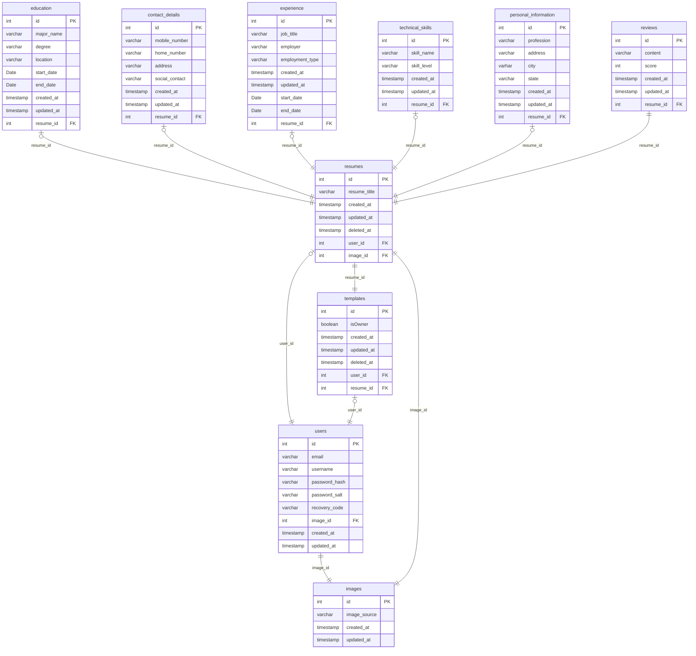

# ResumeGemm

## ℹ️ General Info

This is the repository responsible for ResumeGemm's apps.

## 🏭 Applications

-   [Backend](./backend) — ResumeGemm's application backend.

    _To work properly, fill in the **`.env`** file. Use the **`.env.example`** file as an example._

-   [Frontend](./frontend) — ResumeGemm's application frontend.

    _To work properly, fill in the **`.env`** file. Use the **`.env.example`** file as an example._

-   [Shared](./shared) — ResumeGemm's application common modules for reuse.

## 🖍 Requirements

-   [NodeJS](https://nodejs.org/en/) (18.x.x);
-   [NPM](https://www.npmjs.com/) (9.x.x);
-   [PostgreSQL](https://www.postgresql.org/) (15.2)
-   run **`npx simple-git-hooks`** at the root of the project, before the start (it will set
    the [pre-commit hook](https://www.npmjs.com/package/simple-git-hooks) for any commits).

## 🏃‍♂️ Simple Start

1. **`npm install`** at the root
2. Fill ENVs
3. **`npx simple-git-hooks`** at the root
4. **`cd backend && npm run migrate:dev`** then **`npm run start:dev`**
5. **`cd frontend && npm run start:dev`**
6. Enjoy ❤️

## 🏗 Architecture

### 🛖 Application Schema

TBA

### 💽 DB Schema



### 🌑 Backend

-   [Fastify](https://www.fastify.io/) — a backend framework.
-   [Knex](https://knexjs.org/) — a query builder.
-   [Objection](https://vincit.github.io/objection.js/) — an ORM.

### 🌕 Frontend

-   [React](https://reactjs.org/) — a frontend library.
-   [Redux](https://redux.js.org/) + [Redux Toolkit](https://redux-toolkit.js.org/) — a state manager.

### 🥊 Code quality

-   [simple-git-hooks](https://www.npmjs.com/package/simple-git-hooks) — a tool that lets you easily manage git hooks.
-   [lint-staged](https://www.npmjs.com/package/lint-staged) — run linters on git staged files.
-   [dangerjs](https://danger.systems/js/) — automate common code review chores.
-   [commitlint](https://commitlint.js.org/) — helps your team adhere to a commit convention.
-   [editorconfig](https://editorconfig.org/) — helps maintain consistent coding styles for multiple developers working on
    the same project across various editors and IDEs.
-   [prettier](https://prettier.io/) — an opinionated code formatter.
-   [ls-lint](https://ls-lint.org/) — file and directory name linter.
-   [eslint](https://eslint.org/) — find problems in your JS code.
-   [stylelint](https://stylelint.io/) — find and fix problems in your CSS code.

## 🧑‍💻 CI

### 🗞 Git

#### 🏅 Pull Request flow

```
<project-prefix>-<issue-number>: <ticket-title>
```

##### Example

-   `rg-5: Add Dashboard`

#### 🌳 Branch flow

```
<type>/<project-prefix>-<issue-number>-<short-desc>
```

##### Types

-   task
-   fix

##### Examples

-   `task/rg-5-add-dashboard`
-   `task/rg-12-add-user-flow`
-   `fix/rg-16-fix-user-flow`

#### 🗂 Commit flow

```
<project-prefix>-<issue-number>: <modifier> <description>
```

##### Modifiers

-   `+` (add)
-   `*` (edit)
-   `-` (remove)

##### Examples

-   `rg-5: + title for dashboard`
-   `rg-12: * dashboard title`
-   `rg-16: - dashboard title`

## 📦 CD

[Handled](.github/workflows/cd.yml) by [GitHub Actions](https://docs.github.com/en/actions).
